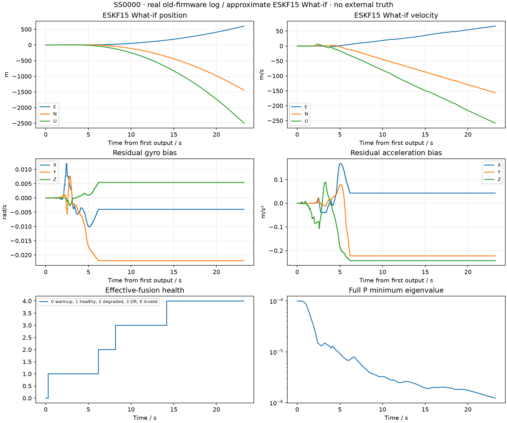
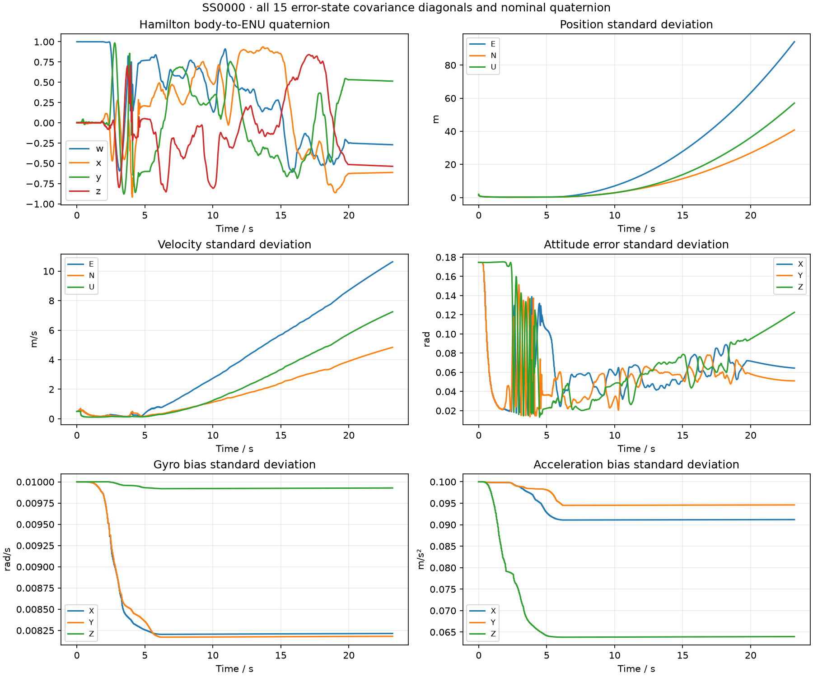

# SS0000 真实日志回归

旧固件真实日志上的新 ESKF What-if；无外部真值，不以末位置差或内部一致性声称绝对精度。

- 原始 SHA256：`f774a990536b3b39c38f09639a7f1d9a5100ea15f3d219ee1667d351d3fac381`，前后保持一致。
- 旧 KF6：completed；旧语义复算完成。
- ESKF What-if：completed，2325 个输出，最终健康=4。
- P 最小特征值=1.23372e-06；四元数范数最大误差=2.22e-16。
- What-if 末位置 ENU=[603.3093232813397, -1443.3146225138328, -2496.8669650223223] m；仅为输出值，不代表真值误差。
- 旧日志缺新 BODY_INPUT、IMU范围/饱和质量和可信原生GNSS时刻，因此不得作为新固件硬件性能通过证据。

| 组 | 有效融合最长间隙(s) | 结果码计数 |
|---|---:|---|
| position_en | 17.042 | {'0': 151, '1': 4, '2': 425} |
| position_u | 18.042 | {'0': 126, '1': 4, '2': 450} |
| velocity_en | 17.481 | {'0': 119, '1': 6, '2': 338, '3': 110, '18': 7} |
| velocity_u | 19.050 | {'0': 72, '1': 9, '2': 382, '3': 110, '18': 7} |
| baro | 18.241 | {'0': 252, '1': 7, '2': 961} |

结果码0正常接受、1软降权接受、2NIS拒绝、3物理/输入无效、5模型不匹配、17时序非法、18历史缺失、19容量不足。

