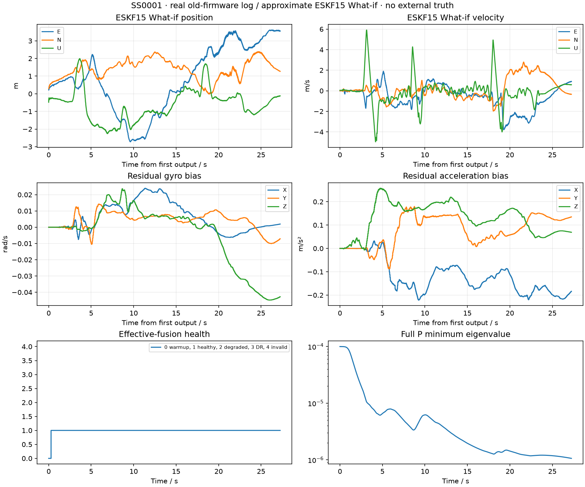
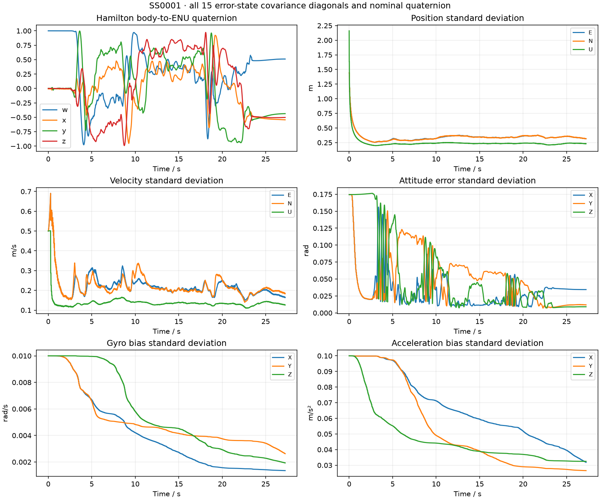

# SS0001 真实日志回归

旧固件真实日志上的新 ESKF What-if；无外部真值，不以末位置差或内部一致性声称绝对精度。

- 原始 SHA256：`65e19a1aeec9d24836a9831549156fbf9579a49b6cd822d1de06ca8f61b71e95`，前后保持一致。
- 旧 KF6：completed；旧语义复算完成。
- ESKF What-if：completed，2727 个输出，最终健康=1。
- P 最小特征值=1.06147e-06；四元数范数最大误差=2.22e-16。
- What-if 末位置 ENU=[3.5523833197981376, 1.2714878990518312, -0.12169654536660388] m；仅为输出值，不代表真值误差。
- 旧日志缺新 BODY_INPUT、IMU范围/饱和质量和可信原生GNSS时刻，因此不得作为新固件硬件性能通过证据。

| 组 | 有效融合最长间隙(s) | 结果码计数 |
|---|---:|---|
| position_en | 0.051 | {'0': 680} |
| position_u | 0.051 | {'0': 675, '1': 5} |
| velocity_en | 0.560 | {'0': 621, '1': 28, '2': 24, '18': 7} |
| velocity_u | 0.280 | {'0': 655, '1': 12, '2': 6, '18': 7} |
| baro | 0.032 | {'0': 1347} |

结果码0正常接受、1软降权接受、2NIS拒绝、3物理/输入无效、5模型不匹配、17时序非法、18历史缺失、19容量不足。

