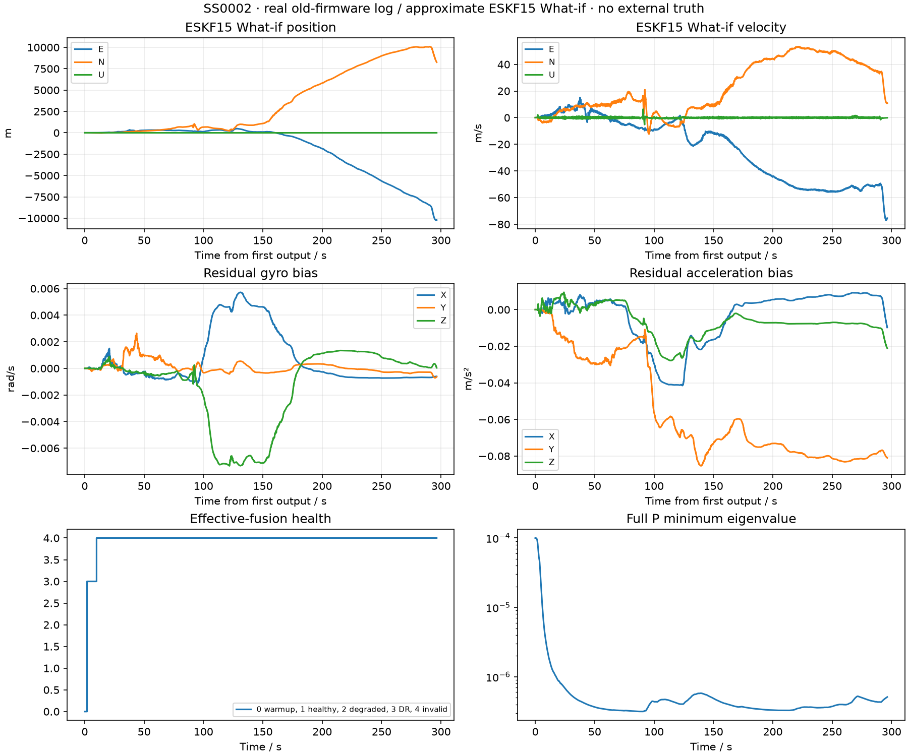
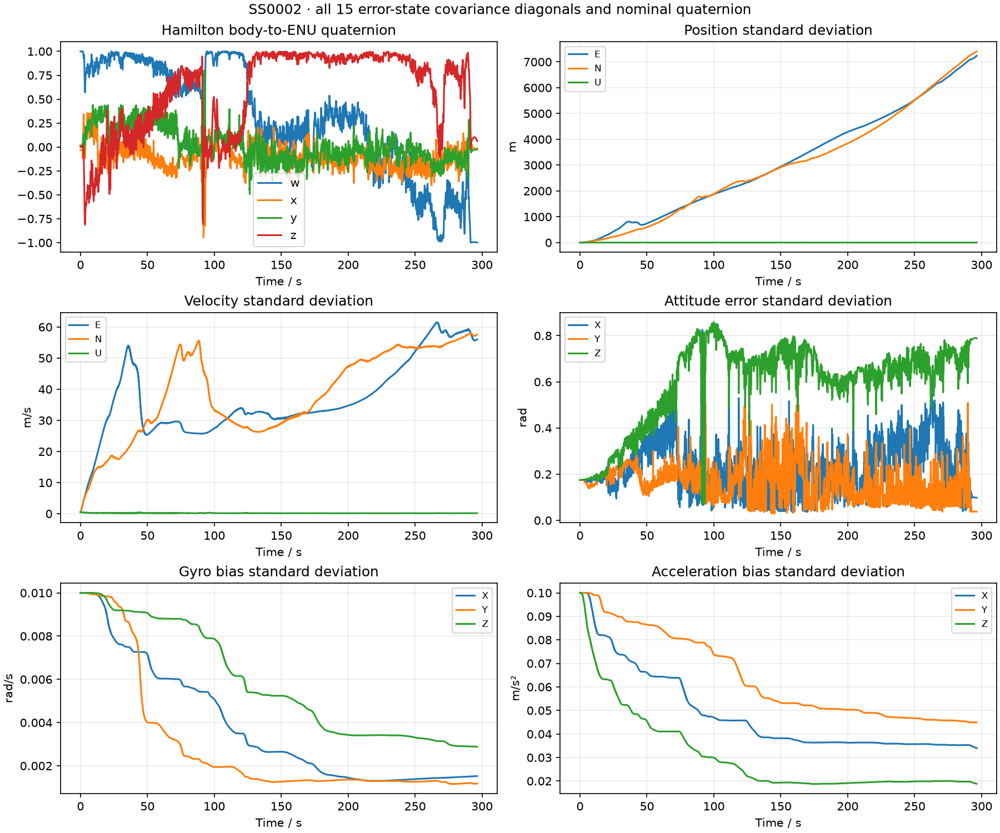

# SS0002 真实日志回归

旧固件真实日志上的新 ESKF What-if；无外部真值，不以末位置差或内部一致性声称绝对精度。

- 原始 SHA256：`b9e8e6a56a18497acb5e6405881fe5128464e478edb1a793822951a55b6989cc`，前后保持一致。
- 旧 KF6：failed；ValueError:gnss_origin_unavailable。
- ESKF What-if：completed，29683 个输出，最终健康=4。
- P 最小特征值=3.15121e-07；四元数范数最大误差=2.22e-16。
- What-if 末位置 ENU=[-10197.497335757844, 8262.156109532496, -1.510974625509653] m；仅为输出值，不代表真值误差。
- 旧日志缺新 BODY_INPUT、IMU范围/饱和质量和可信原生GNSS时刻，因此不得作为新固件硬件性能通过证据。

| 组 | 有效融合最长间隙(s) | 结果码计数 |
|---|---:|---|
| position_en | 296.385 | {} |
| position_u | 296.385 | {} |
| velocity_en | 296.385 | {} |
| velocity_u | 296.385 | {} |
| baro | 0.022 | {'0': 15554} |

结果码0正常接受、1软降权接受、2NIS拒绝、3物理/输入无效、5模型不匹配、17时序非法、18历史缺失、19容量不足。

