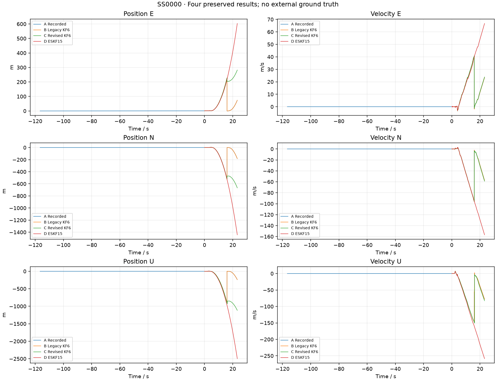
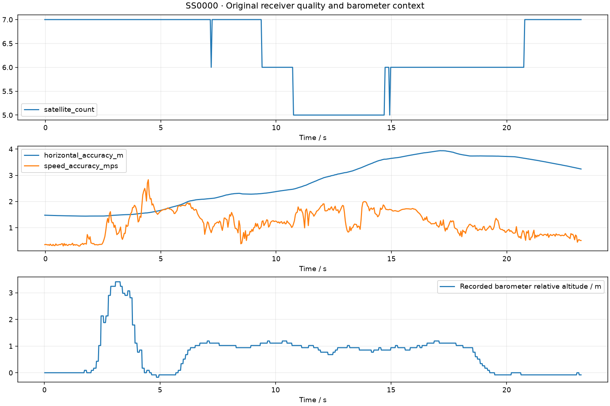

# SS0000 四组真实日志对比

所有输入与匹配 decoder 均只读且前后 SHA256 相同。无独立真值；末位置只是输出，不是误差。

| 组 | 结果 | 末位置 ENU / m |
|---|---|---|
| A Recorded | 原始记录 | [73.4533920288086, -182.41128540039062, -238.18162536621094] |
| B 旧版 KF6 | completed:  | [73.9207534790039, -183.5604248046875, -239.74212646484375] |
| C 修复后 KF6 | completed:  | [282.1622619628906, -667.0371704101562, -1116.981689453125] |
| D ESKF15 | completed; 健康 4 | [603.3093232813397, -1443.3146225138328, -2496.8669650223223] |

C 保留旧记录的操作及已解析时序，仅应用新物理/质量/窗口方差与外层有效融合监督；旧日志没有的操作不补造。C/D 均为 What-if，不能冒充新固件同版实飞。
SS0002 缺 GNSS 原点造成的 KF 失败原样保留。SS0000/SS0002/SS0004 的 ESKF 长时间拒融与严重漂移仍为 INVALID，不能宣称性能通过。
新 IMU 范围读回、饱和和质量标志在旧日志中缺失；原生 GNSS 绝对 iTOW 对齐证据不足。主机计算耗时不是 MCU 实时预算。

ESKF 全部15维协方差、四元数、bias和融合组诊断见 ../../five_logs_contract_final/SS0000/REPORT.md。
C 健康与窗口逐证据见 comparison.json；原始完整数值结果保留在各自运行目录。
